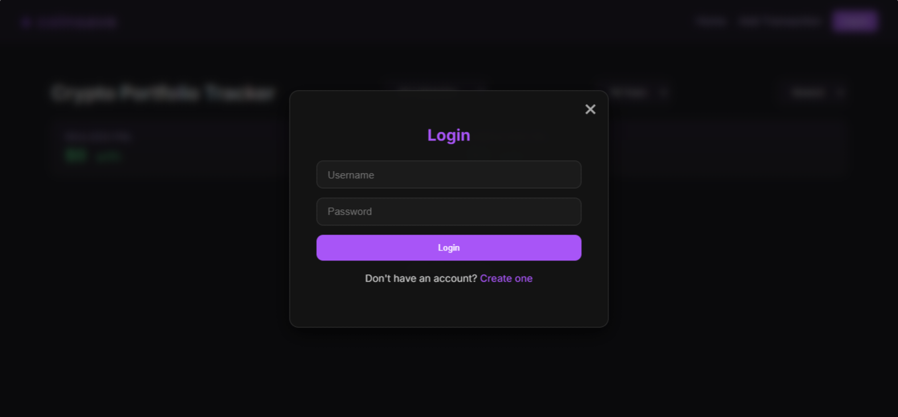
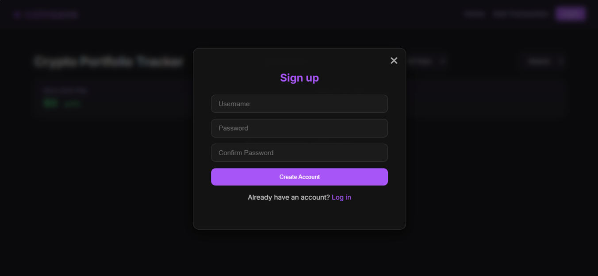
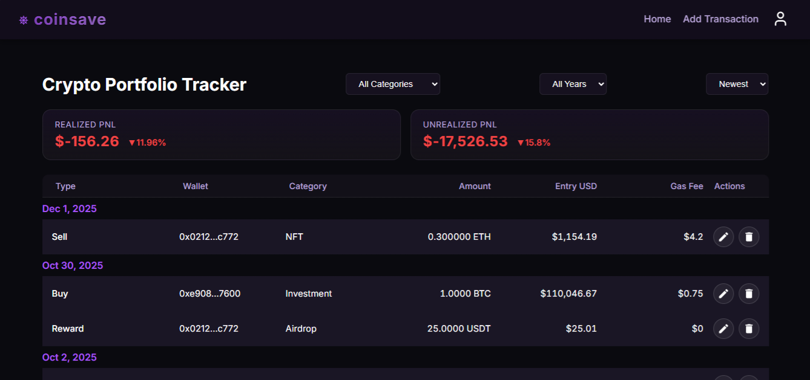
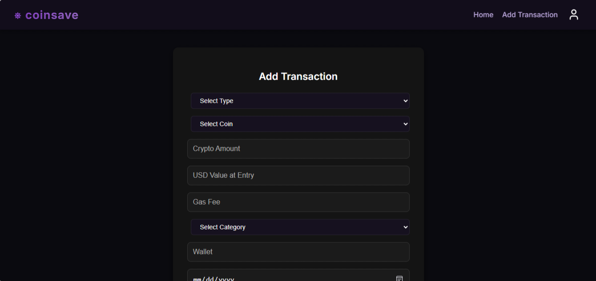

# coinsave 

A full-stack crypto portfolio tracker built with React and Django REST Framework that helps users track transactions and calculate realized and unrealized PnL.


## Features

* Display transactions grouped and sorted by date
* Add, edit, and delete crypto transactions
* Realized & unrealized PnL calculation
* Clean, dark-themed UI inspired by professional crypto tools


## Tech Stack

**Frontend**

* React
* Custom CSS (dark theme UI)

**Backend**

* Django
* Django REST Framework

**Database**

* SQLite

**Authentication**

* Session-based authentication


##Screenshots






## Project Structure

```
react-tracker/   # React frontend
myapp/          # Django REST API backend
```
